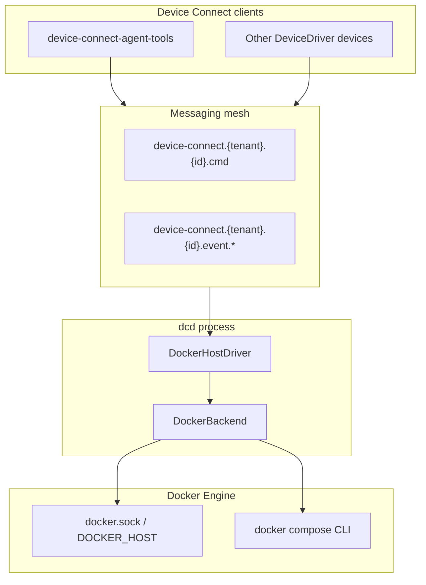

# Design — dcd (Device Connect Docker host driver)

## Goal

Expose a **Docker Engine** as a first-class **Device Connect** device (`device_type = docker_host`) so agents and peer devices can provision and operate containers through the same JSON-RPC and event model used for robots, voice assistants, and other drivers — over **D2D** or **Portal**.

dcd is a **long-running driver process** aligned with `DeviceRuntime` + `DeviceDriver`, not a one-shot deploy CLI.

## Architecture

### Layers

| Layer                 | Responsibility                                                     |
| --------------------- | ------------------------------------------------------------------ |
| `DockerHostDriver`    | `@rpc` / `@emit`; state poll loop from `DCD_STATE_POLL_HZ` |
| `DockerBackend`       | Abstract async Docker operations                                   |
| `DockerEngineBackend` | [docker-py](https://docker-py.readthedocs.io/) against Engine API  |
| `SimDockerBackend`    | In-memory simulator for tests and `--sim`                          |
| `runtime_launcher`    | CLI, portal credential loading, `DeviceRuntime` wiring             |

Discovery and credentials follow the same patterns as `lerobot-device-connect` and `device-connect-voice`: no custom control plane inside dcd.

## D2D vs Portal

| Aspect            | D2D                                   | Portal                                   |
| ----------------- | ------------------------------------- | ---------------------------------------- |
| Discovery         | `PresenceCollector` / multicast       | etcd registry via portal                 |
| Credentials       | Often `DEVICE_CONNECT_ALLOW_INSECURE` | NATS JWT from `.creds.json`              |
| Messaging URLs    | Empty → Zenoh default                 | From creds or `nats://portal…`           |
| dcd configuration | `dcd --allow-insecure`                | `dcd --portal --nats-credentials-file …` |

The **same RPC surface** is used in both modes; only the mesh attachment differs.

## Relationship to **tcd** (Topo driver)

Edge/container control is split across two Device Connect drivers:

| Project             | `device_type`   | Use when                                                                               |
| ------------------- | --------------- | -------------------------------------------------------------------------------------- |
| **dcd** (this repo) | `docker_host`   | Docker Engine is **local** (bare metal, VM, or `docker.sock` mount)                    |
| **[tcd](../tcd)**   | `topo_deployer` | Workloads deploy to **remote Arm64** boards via Topo (SSH build/transfer/`compose up`) |

dcd does **not** wrap Topo. Remote-engine access via `DOCKER_HOST=ssh://…` is possible but does not replace Topo’s image-transfer pipeline; use **tcd** for that workflow.

See [tcd/DESIGN.md](../tcd/DESIGN.md) for the Topo CLI wrapper design.

## Security considerations

- Mounting `docker.sock` grants **root-equivalent** access on the host. Restrict who can invoke `docker_host` devices via portal tenant ACLs and NATS JWT scopes.
- `exec_in_container` runs arbitrary commands; treat as privileged RPC.
- Prefer portal-provisioned credentials over `ALLOW_INSECURE` outside development.
- Labels (`deviceconnect.dev/managed`) help identify driver-created resources; they are not a security boundary.

## Container and Topo deployment

- **Dockerfile** — Python driver + `docker` / `compose` CLI; mount `/var/run/docker.sock` to control the host Engine.
- **`compose.yaml`** — Topo template (`x-topo`) for `topo deploy` to Arm64 targets; build args set `DEVICE_ID`, `TENANT`, and D2D insecure mode.
- **`deploy/topo.md`** — Portal credentials, stop/update, and security guidance.

## Deployment topologies

1. **Bare metal edge host** — `dcd` on the gateway, local socket, D2D to robots on LAN.
2. **Driver container** — `examples/docker-compose.dcd.yml`, socket bind-mount.
3. **Remote engine** — `DOCKER_HOST` / `dcd --docker-host` pointing at TCP or SSH transport (Engine must be reachable from the driver process).

## Log follow and attach

- **`container_logs(follow=true)`** starts a background stream; each line is emitted as **`container_log_line`**. Call **`stop_container_logs`** to end the stream.
- **Interactive attach / TTY** is intentionally **out of scope** — use **`exec_in_container`** for one-shot commands.

## Future work

See [TODO.md](TODO.md). Highlights: follow compose project labels, remote image sync patterns inspired by Topo, PyPI publish.